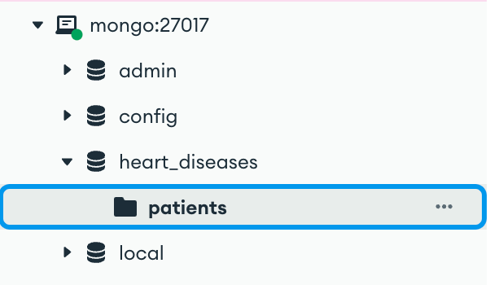

# Instructions

## Start

Open a terminal in the root of the project then run the command 
```bash
docker-compose up 
```
Add the `-d` flag to run the containers in background.

To start a clean project:
```bash
docker-compose down && docker volume rm $(docker volume ls -q) &&  docker-compose build && docker-compose up
```

To access the database from the terminal, run 
```bash
docker exec -it mongo_container mongosh
``` 

When everything is running, run the command
```bash
python ./hadoop/fetcher/fetch.py
```


## Stop

To end the process properly, run the command 
```bash
docker-compose down
```

## Database connection 

To navigate into the database easily, u can download a mongo client (mongo compass for exemple) and connect using this url: `mongodb://localhost:27017/`

On mongo compass, you'll get something like this: 


# Machine learning


## Which method use ?
The method use is XGBoost
## Which part can you use ? 
### improve_model
This function allows us to improve the model with new batch data.

To use it you need to put in input:
- The model himself
- New batch of data, as a dataframe

It will return the model updated

### Predicted_record
This function allows us to predict the output of one given record

To use it you need to put in input:
- the record that you want to predict, as a list of values (respecting the order of the mongo database)
- the model 

It will return you an int 
- 0 : No heart disease
- 1 : Heart disease

If you have any question contact me.

### How to use the model 
the file .py name "model.py" is saved in machine_learning folder.

You can, use directly this script and the two functions

```python
model(iterations)
```
To trained and create the model.
If we want to use the improvement function same 
```python
improve_model(model,new_batch)
```
To predicted a record
```python
predicted_record(record,model)
```

Or you can use the file "trained_model.pkl"
Then you can load the model directly using the pickle library

```python
import pickle
with open('trained_model.pkl', 'rb') as file:
    loaded_model = pickle.load(file)
record = (a set of values)
prediction = loaded_model.predict(record)
```

And that's it.